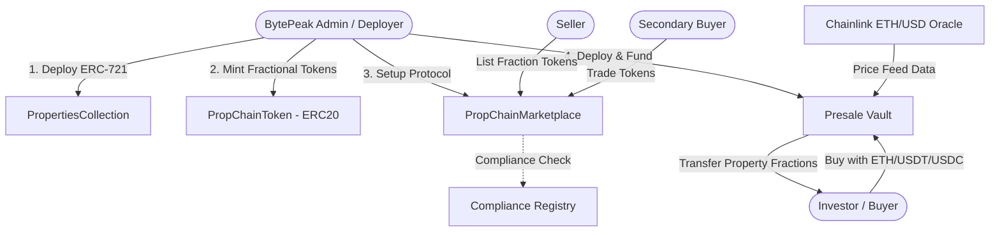

# 🏢 PropChain — Real Estate Asset Tokenization Protocol (RWA)

[](https://sepolia.arbiscan.io/)
[](https://soliditylang.org/)
[](https://getfoundry.sh/)
[](LICENSE)

**PropChain** is a decentralized platform for the fractionalization and trading of Real World Assets (RWA), specifically real estate properties. The protocol enables property ownership tokenization, issuance of fractional property shares via ERC-20 tokens, initial primary fundraising (crowdfunding) using dynamic Chainlink price oracles, and secondary market trading with integrated compliance control.

---

## 📐 Protocol Architecture

The ecosystem consists of four interconnected smart contracts built using **OpenZeppelin v5** security standards and deployed on **Arbitrum Sepolia**:


    
## 📜 Verified Contracts on Arbiscan
All protocol contracts have been deployed, verified, and audited at the bytecode level on the Arbitrum Sepolia network (Chain ID: 421614):

| Contract | Standard / Function | Address (Arbitrum Sepolia) | Status |
| :--- | :--- | :--- | :---: |
| **`PropertiesCollection`** | **ERC-721** — NFT Representation of Real Estate Titles | [`0x0f2221ef018d5e8d57d94caa57b711cc8ab2dc98`](https://sepolia.arbiscan.io/address/0x0f2221ef018d5e8d57d94caa57b711cc8ab2dc98#code) | Verified ✅ |
| **`PropChainToken`** | **ERC-20** — Asset Fractionalization (Apartment 4B Miami) | [`0x74b0a232bd050b095dbf6baed89844df7d1cc058`](https://sepolia.arbiscan.io/address/0x74b0a232bd050b095dbf6baed89844df7d1cc058#code) | Verified ✅ |
| **`PropChainMarketplace`** | **Marketplace** — Secondary Trading for RWA Fractions | [`0xc5821be8211d601c85b79cfb44b4149b0ca8e3ee`](https://sepolia.arbiscan.io/address/0xc5821be8211d601c85b79cfb44b4149b0ca8e3ee#code) | Verified ✅ |
| **`Presale`** | **Crowdfunding** — Primary Sales Vault with Chainlink Oracle | [`0x9c8932c187f9e79c075e94e3a7b0d50f0e1caf88`](https://sepolia.arbiscan.io/address/0x9c8932c187f9e79c075e94e3a7b0d50f0e1caf88#code) | Verified ✅ |

## 🚀 Key Features
ERC-721 Tokenization (PropertiesCollection): Immutable registry for real estate properties with metadata stored on IPFS.

ERC-20 Fractionalization (PropChainToken): Division of property value into tradable tokens with fixed supply.

Multi-Currency Presale Vault (Presale): Purchase fractions using ETH, USDT, or USDC. Integrates Chainlink Price Feeds for real-time ETH/USD rate conversion.

Secondary Marketplace (PropChainMarketplace): Listing creation and cancellation, validation against a Compliance Registry, and configurable protocol fees.

## 🛠️ Tech Stack
Language: Solidity 0.8.29

Development Framework: Foundry (forge, cast)

Security Libraries: OpenZeppelin Contracts v5.x

Oracles: Chainlink Data Feeds

Static Analysis & Code Quality: Slither, Solhint

Network: Arbitrum Sepolia Testnet

## 💻 Local Development Setup
Prerequisites
Install Foundry:
```
curl -L [https://foundry.paradigm.xyz](https://foundry.paradigm.xyz) | bash
foundryup
```

Clone the Repository and Install Dependencies
```
git clone [https://github.com/Alexka-Dev/PopChainMarketplace](https://github.com/Alexka-Dev/PopChainMarketplace)
cd PropChainMarketplace/contracts
forge install
```

Compile Smart Contracts
```
forge build
```

Run Test Suite (Unit and E2E Tests)
```
forge test -vvv
```

## 📄 License & Credits
Developed by AlexkDev & BytePeak Technology.

Distributed under the MIT License. See LICENSE for details.